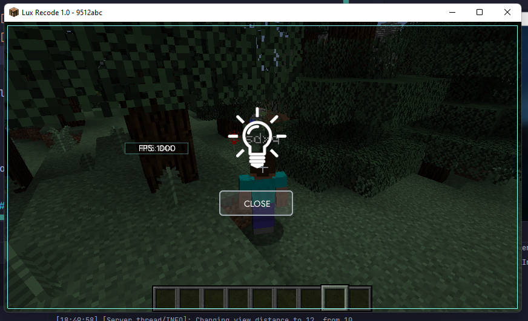

<h1 align="center">
  <a href="https://github.com/sdxqw/LuxRecode">Lux Recode</a>
</h1>

<h4 align="center">LuxRecode because yes.</h4>

# Start using LuxRecode
Please check [_**TCL-java**_](https://github.com/AxstSoftware/TCL-Java/wiki) 

# Thanks

to the official code of LuxClient

## Contributing

Ways to contribute to LuxRecode:

* Making some commit ex(fixes, new features...)
* Sharing this repo

---
<h6 align="center">
  | GitHub - <a href="https://github.com/sdxqw">@sdxqw</a> 
  |
</h6>
